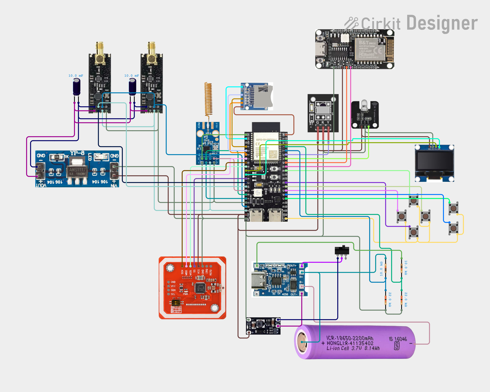
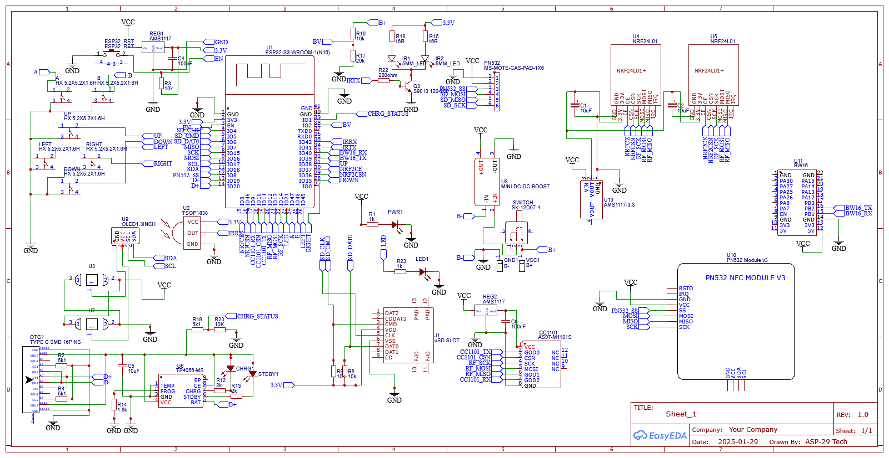

# ZeroX32 Project

ZeroX32 is a multi-tool firmware project inspired by devices like Flipper Zero and community firmware such as Bruce Firmware.  
The project is powered by ESP32-S3 as the main microcontroller.
> ⚠️ **Responsible use:** This project includes features that can be misused (for example: deauthentication, captive portals, BLE/packet spam, jamming). Use these features **only** on devices and networks you own or where you have explicit permission. Comply with local laws and regulations.
# Hardware Mapping

## ESP32-S3 Pin Configuration

| Function | GPIO | Description |
|----------|------|-------------|
| BUTTON UP | GPIO 38 | Navigation Up |
| BUTTON DOWN | GPIO 35 | Navigation Down |
| BUTTON RIGHT | GPIO 0 | Navigation Right |
| BUTTON LEFT | GPIO 45 | Navigation Left |
| BUTTON A | GPIO 47 | Action Button A |
| BUTTON B | GPIO 48 | Action Button B |
| UART RX | GPIO 40 | Serial RX |
| UART TX | GPIO 39 | Serial TX |
| Battery ADC | GPIO 2 | Battery Voltage Monitoring |
| Charge Detect | GPIO 1 | Charging Status |
| I2C SCL | GPIO 17 | I2C Clock |
| I2C SDA | GPIO 18 | I2C Data |
| Status LED | GPIO 21 | Indicator LED |

---

# CC1101 Sub-GHz Module

| CC1101 Pin | ESP32-S3 GPIO |
|------------|---------------|
| SCK | GPIO 14 |
| MOSI | GPIO 13 |
| MISO | GPIO 12 |
| CSN | GPIO 10 |
| GDO2 / RX | GPIO 9 |
| GDO0 / TX | GPIO 11 |

CC1101 frequency support depends on the module variant used.

---

# NRF24L01 Module

## NRF24L01 Module 1

| NRF24L01 | ESP32-S3 |
|----------|----------|
| CE | GPIO 3 |
| CSN | GPIO 46 |

## NRF24L01 Module 2

| NRF24L01 | ESP32-S3 |
|----------|----------|
| CE | GPIO 37 |
| CSN | GPIO 36 |

---

# SD Card Interface

SD Card uses SDMMC 1-bit mode.

| SD Card Signal | ESP32-S3 GPIO |
|----------------|---------------|
| CLK | GPIO 4 |
| CMD / MOSI | GPIO 5 |
| DAT0 / MISO | GPIO 6 |

---

# VSPI Interface

| SPI Signal | ESP32-S3 GPIO |
|------------|---------------|
| MISO | GPIO 7 |
| MOSI | GPIO 16 |
| SCK | GPIO 15 |

---

# PN532 NFC Module

| PN532 | ESP32-S3 |
|-------|----------|
| SS | GPIO 8 |

---

# Infrared Interface

| Function | ESP32-S3 GPIO |
|----------|---------------|
| IR Receiver | GPIO 42 |
| IR Transmitter | GPIO 41 |

---

# Hardware Schematic

Complete circuit diagram:

<p align="center">

</p>

<p align="center">

</p>

---

# Firmware Installation

## Required Files

Before flashing, make sure the firmware folder contains the following files:

```text
Firmware/
├── bootloader.bin
├── partitions.bin
├── firmware.bin
├── littlefs.bin
└── flash.bat
```

---

# Automatic Flashing (Windows)

## Run Flash Tool

Execute:

```bat
flash.bat
```

The flashing tool will automatically:

1. Detect available COM ports.
2. Select the hardware target.
3. Erase ESP32-S3 flash memory.
4. Write firmware and filesystem images.

## Example

Available COM Ports:

```text
1. COM3
2. COM11
```

Select the serial port:

```text
Choose COM port number: 2

Selected Port: COM11
```

Select hardware target:

```text
1. ESP32S3
2. BW16
```

Choose:

```text
1
```

for **ESP32-S3**.

---

# Manual Flashing

## ESP32-S3 Flash Layout

| File | Address |
|------|---------|
| bootloader.bin | `0x0000` |
| partitions.bin | `0x8000` |
| firmware.bin | `0x10000` |
| littlefs.bin | `0x410000` |

## Flash Command

Run:

```bash
esptool.exe --chip esp32s3 --port COMx --baud 921600 write_flash ^
0x0 bootloader.bin ^
0x8000 partitions.bin ^
0x10000 firmware.bin ^
0x410000 littlefs.bin
```

Replace:

```text
COMx
```

with your ESP32-S3 serial port.

Example:

```bash
--port COM11
```

---

# LittleFS Filesystem

The LittleFS image contains internal ESP32-S3 filesystem data.

## Source Folder

```text
littlefs files/
```

## Flash Location

| Parameter | Value |
|-----------|-------|
| Offset | `0x410000` |
| Size | `0x3E0000` |

---

# SD Card Files

Copy SD card resources manually:

```text
sdcard files/
```

to the **root directory** of the SD card.

## Recommended Format

```text
FAT32
```

Example structure:

```text
SD Card/
├── file1
├── file2
└── folders/
```

---

# First Boot

After successful flashing:

1. Insert the SD card.
2. Power on **ZeroX32**.
3. Wait for filesystem initialization.
4. Configure connected modules from the device menu.

---

## Notes

- Use a stable USB connection during flashing.
- Avoid disconnecting power while writing firmware.
- Make sure the correct hardware target is selected before flashing.

---

## WiFi
- Scanning for access points, station mode, and discovering hidden SSIDs and reveals them
- Deauthentication (deauth) testing against selected targets
- WiFi beacon attacks with customizable SSID lists and random names
- Captive (evil) portal with up to 5 different HTML pages, and customizable domain names
- Packet monitor for detecting nearby deauth attacks from other actors
- Supported 2.4ghz and 5ghz band,with bw16/RTL8720DN addons

## Bluetooth
- BLE spam and pairing tests, including iOS, Swift Pair, Samsung, and Google Fast Pair
- Remote controller functionality (media control and mouse emulation)

## Infrared
- Read custom IR remotes
- Load IR remote data from files; compatible with Flipper Zero IR database
- Send IR data in sequences with configurable intervals (used for brute-force testing)
- Universal remote functionality similar to Flipper Zero — see SD card files under `infrared/UNIVERSAL REMOTE/...`

  ### Supported IR protocols
| Protocol               | Send | Receive | Description                        |
|------------------------|------|---------|------------------------------------|
| NEC                    | ✅   | ✅       | Common in many TV remotes          |
| SONY                   | ✅   | ✅       | Sony TVs, audio systems            |
| SAMSUNG                | ✅   | ✅       | Samsung TVs and AC units           |
| LG                     | ✅   | ✅       | LG TVs and air conditioners        |
| JVC                    | ✅   | ✅       |                                    |
| PANASONIC              | ✅   | ✅       | Includes Panasonic AC              |
| MITSUBISHI_AC          | ✅   | ✅       | Mitsubishi air conditioners        |
| DAIKIN                 | ✅   | ✅       | Daikin AC (multiple variants)      |
| FUJITSU_AC             | ✅   | ✅       | Fujitsu air conditioners           |
| TOSHIBA_AC             | ✅   | ✅       | Toshiba air conditioners           |
| HITACHI_AC             | ✅   | ✅       | Hitachi air conditioners           |
| GREE                   | ✅   | ✅       | Gree air conditioners              |
| WHIRLPOOL_AC           | ✅   | ✅       | Whirlpool air conditioners         |
| COOLIX                 | ✅   | ✅       | Used in TCL, Nikai, and similar    |
| MIDEA                  | ✅   | ✅       | Midea air conditioners             |
| RC5 / RC6              | ✅   | ✅       | Used in Philips and others         |
| SHARP                  | ✅   | ✅       | Sharp TVs                          |
| SANYO_AC               | ✅   | ✅       | Sanyo air conditioners             |
| CARRIER_AC             | ✅   | ✅       | Carrier air conditioners           |
| AUX                    | ✅   | ✅       | AUX brand ACs                      |
| VOLTAS                 | ✅   | ✅       | Voltas air conditioners            |
| YORK                   | ✅   | ✅       | York ACs                           |
| TECO                   | ✅   | ✅       | Teco ACs                           |
| ZEPEAL                 | ✅   | ✅       |                                    |
| BOSE                   | ✅   | ✅       |                                    |
| PIONEER                | ✅   | ✅       |                                    |
| RCMM                   | ✅   | ✅       | Used in some advanced remotes      |
| RAW / PRONTO           | ✅   | ❌       | Manual/custom IR signal sending    |
| GLOBALCACHE            | ✅   | ❌       | Sends in GlobalCache format        |
| SHERWOOD               | ✅   | ❌       | Send-only protocol                 |
| LEGOPF                 | ✅   | ✅       | LEGO Power Functions (IR motors)   |

    For legacy list
    | Index | Protocol              | Index | Protocol               |
    |-------|-----------------------|-------|------------------------|
    | 1     | RC5                   | 65    | DAIKIN160              |
    | 2     | RC6                   | 66    | NEOCLIMA               |
    | 3     | NEC                   | 67    | DAIKIN176              |
    | 4     | SONY                  | 68    | DAIKIN128              |
    | 5     | PANASONIC             | 69    | AMCOR                  |
    | 6     | JVC                   | 70    | DAIKIN152              |
    | 7     | SAMSUNG               | 71    | MITSUBISHI136          |
    | 8     | WHYNTER               | 72    | MITSUBISHI112          |
    | 9     | AIWA_RC_T501          | 73    | HITACHI_AC424          |
    | 10    | LG                    | 74    | SONY_38K               |
    | 11    | SANYO                 | 75    | EPSON                  |
    | 12    | MITSUBISHI            | 76    | SYMPHONY               |
    | 13    | DISH                  | 77    | HITACHI_AC3            |
    | 14    | SHARP                 | 78    | DAIKIN64               |
    | 15    | COOLIX                | 79    | AIRWELL                |
    | 16    | DAIKIN                | 80    | DELONGHI_AC            |
    | 17    | DENON                 | 81    | DOSHISHA               |
    | 18    | KELVINATOR            | 82    | MULTIBRACKETS          |
    | 19    | SHERWOOD              | 83    | CARRIER_AC40           |
    | 20    | MITSUBISHI_AC         | 84    | CARRIER_AC64           |
    | 21    | RCMM                  | 85    | HITACHI_AC344          |
    | 22    | SANYO_LC7461          | 86    | CORONA_AC              |
    | 23    | RC5X                  | 87    | MIDEA24                |
    | 24    | GREE                  | 88    | ZEPEAL                 |
    | 25    | PRONTO                | 89    | SANYO_AC               |
    | 26    | NEC_LIKE              | 90    | VOLTAS                 |
    | 27    | ARGO                  | 91    | METZ                   |
    | 28    | TROTEC                | 92    | TRANSCOLD              |
    | 29    | NIKAI                 | 93    | TECHNIBEL_AC           |
    | 30    | RAW                   | 94    | MIRAGE                 |
    | 31    | GLOBALCACHE           | 95    | ELITESCREENS           |
    | 32    | TOSHIBA_AC            | 96    | PANASONIC_AC32         |
    | 33    | FUJITSU_AC            | 97    | MILESTAG2              |
    | 34    | MIDEA                 | 98    | ECOCLIM                |
    | 35    | MAGIQUEST             | 99    | XMP                    |
    | 36    | LASERTAG              | 100   | TRUMA                  |
    | 37    | CARRIER_AC            | 101   | HAIER_AC176            |
    | 38    | HAIER_AC              | 102   | TEKNOPOINT             |
    | 39    | MITSUBISHI2           | 103   | KELON                  |
    | 40    | HITACHI_AC            | 104   | TROTEC_3550            |
    | 41    | HITACHI_AC1           | 105   | SANYO_AC88             |
    | 42    | HITACHI_AC2           | 106   | BOSE                   |
    | 43    | GICABLE               | 107   | ARRIS                  |
    | 44    | HAIER_AC_YRW02        | 108   | RHOSS                  |
    | 45    | WHIRLPOOL_AC          | 109   | AIRTON                 |
    | 46    | SAMSUNG_AC            | 110   | COOLIX48               |
    | 47    | LUTRON                | 111   | HITACHI_AC264          |
    | 48    | ELECTRA_AC            | 112   | KELON168               |
    | 49    | PANASONIC_AC          | 113   | HITACHI_AC296          |
    | 50    | PIONEER               | 114   | DAIKIN200              |
    | 51    | LG2                   | 115   | HAIER_AC160            |
    | 52    | MWM                   | 116   | CARRIER_AC128          |
    | 53    | DAIKIN2               | 117   | TOTO                   |
    | 54    | VESTEL_AC             | 118   | CLIMABUTLER            |
    | 55    | TECO                  | 119   | TCL96AC                |
    | 56    | SAMSUNG36             | 120   | BOSCH144               |
    | 57    | TCL112AC              | 121   | SANYO_AC152            |
    | 58    | LEGOPF                | 122   | DAIKIN312              |
    | 59    | MITSUBISHI_HEAVY_88   | 123   | GORENJE                |
    | 60    | MITSUBISHI_HEAVY_152  | 124   | WOWWEE                 |
    | 61    | DAIKIN216             | 125   | CARRIER_AC84           |
    | 62    | SHARP_AC              | 126   | YORK                   |
    | 63    | GOODWEATHER           | 127   | BLUESTARHEAVY          |
    | 64    | INAX                  |       |                        |

You can also load IR files from Flipper Zero. Related repo: https://github.com/logickworkshop/Flipper-IRDB

Thanks to the amazing `IRremoteESP8266` library by @crankyoldgit: https://github.com/crankyoldgit/IRremoteESP8266

---
## Sub-GHz
### Supported RF / devices
| Device / Protocol Type              | Supported | Notes                                                  |
|------------------------------------|-----------|--------------------------------------------------------|
| Intertechno (old models)           | ✅         | Fixed code only; rolling code not supported            |
| Nexa (older versions)              | ✅         | Basic RF switches                                      |
| Elro RF switches                   | ✅         | Common 433 MHz devices                                 |
| Brennenstuhl remote plugs          | ✅         | Some models supported                                  |
| Chacon                             | ✅         | Similar to Intertechno                                 |
| KlikAanKlikUit (KAKU)              | ✅         | Old models without rolling code                        |
| HomeEasy (UK, old models)          | ✅         | Older versions supported                               |
| Generic 433 MHz Chinese remotes    | ✅         | Widely used in low-cost RF modules                     |
| EV1527 RF modules                  | ✅         | Common fixed-code encoder chip                         |
| PT2262 / SC2262 / HX2262           | ✅         | Basic encoder chips used in many RF devices            |
| LC Technology RF Modules           | ✅         | Cheap TX/RX modules compatible with Arduino            |

- Read and decode supported protocols and save them
- Read raw data for unknown protocols and save it
- Presets for modulation: `AM270`, `AM650`, `FM238`, `FM476`, `FM95`, `FM15k`, `Pagers`, `HND_1`, `HND_2`
  - Thanks to Derek Jamieson for the Sub-GHz wiki explanation: https://github.com/jamisonderek/flipper-zero-tutorials/wiki/Sub-GHz
- Supports Flipper Zero `.sub` files (raw format only) for transmit/replay
- Jammer feature with continuous wave (use responsibly and legally)
- Frequency analyzer to detect your keyfob frequency if unknown

Related repos:
- https://github.com/tobiabocchi/flipperzero-bruteforce
- https://github.com/UberGuidoZ/Flipper

---

## Bad USB
- Run selected Ducky Script payloads (inspired by Spacehuhn's WiFi Duck: https://github.com/SpacehuhnTech/WiFiDuck and fork by wasdwasd0105: https://github.com/wasdwasd0105/SuperWiFiDuck)
- Autorun option when USB is plugged into the target (use responsibly)
- Supports Flipper Zero payloads

Related repos:
- https://github.com/bst04/payloads_flipperZero
- https://github.com/MarkCyber/BadUSB

---

## File Manager
- Built-in interactive file explorer to load saved files, perform firmware updates, rename, delete, and manage HTML files for captive portals
- Web server support for file upload

---

## NRF24L01
- Can perform signal operations around 2.4 GHz (e.g., monitoring, jamming)
- Signal / spectrum analyzer for monitoring 2.4 GHz traffic
- Inspired by cifertech's nRFBox: https://github.com/cifertech/nRFBox

---

## NFC with PN532
- Detecting the card type
- Dump data -> automatic save to sdcard
- A/B key bruteforce to unlocking the sectors
- Clone card -> dump the target card and write to new/blank card
- Emulation -> coming soon

---

## Headless Control
- Headless control with limited features via a web server
- Screen mirroring feature similar to Flipper Zero — see: https://www.youtube.com/shorts/sRir4fzV7GA

---

## License & Disclaimer
- Firmware binaries and certain release assets are **proprietary**.
- Source code included in this repository is provided for **personal or educational use only** and may **not** be redistributed without permission.
- The project is provided "as-is". The author is not responsible for misuse. Always comply with local laws and obtain permission before testing on networks or devices you do not own.

I will update other features and documentation over time
for fastest information update you can subscribe my youtube channel https://www.youtube.com/@asp-29blackhat18 and https://www.youtube.com/@ASP29Tech
join my group if you want asking some information directly https://t.me/X32Project

    

